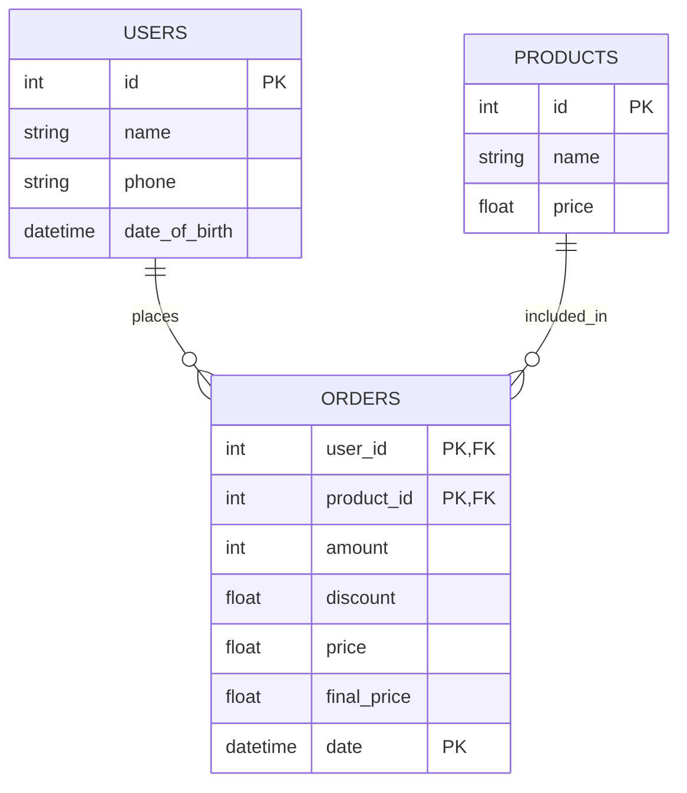
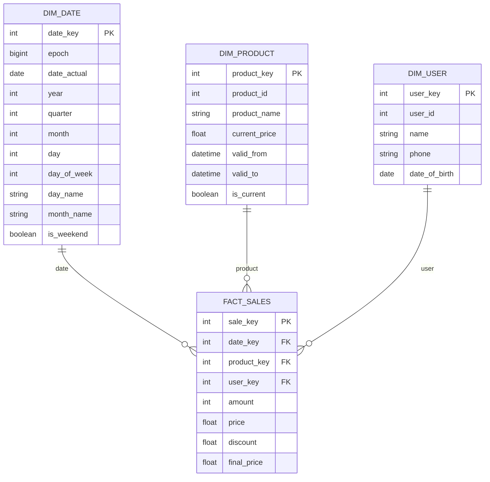
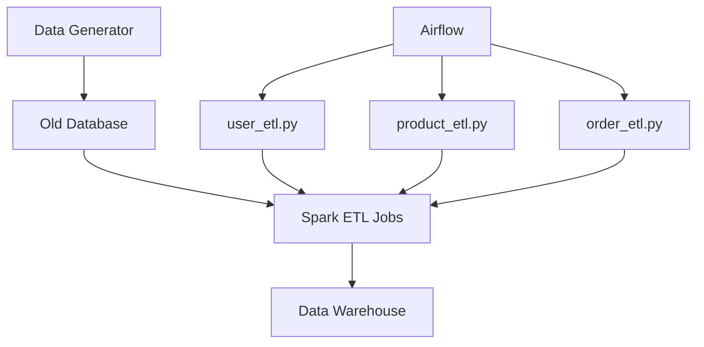

# SanppTrip Interview Challenge (Data Engineering)

## Global Retail Chain Data Warehouse Project

## Project Description

This project implements a data warehouse solution for a global retail chain using the Kimball model. The original system consists of a PostgreSQL database with three main tables: Users (100 million rows), Products (12 million rows), and Orders (900 million rows). The project aims to address several challenges and requirements:

- Large volume of data with limited indexing
- Lack of update tracking in the original system
- Need for handling product updates without losing historical data
- Requirement for near real-time warehouse updates (within 5 minutes)
- Use of open-source tools and Python for implementation

## Implementation Details

- **Technologies Used**: Python, Apache Spark, Apache Airflow, PostgreSQL
- **ETL Process**: Three main ETL scripts implemented:
  1. `user_etl.py`: Transfers user records from old DB to DIM_USER (runs daily)
  2. `product_etl.py`: Moves product records from old DB to DIM_PRODUCT (runs hourly)
  3. `order_etl.py`: Transfers order records from old DB to FACT_SALES (runs every 5 minutes)
- **Data Generation**: A script to generate sample data for testing
- **Infrastructure**: Docker Compose file for setting up Airflow and Spark environments

## Database Schemas

### Old Database Schema



### New Warehouse Schema



## ETL Process



## Setup and Usage

1. Clone the repository
2. Ensure Docker and Docker Compose are installed on your system
3. Run `docker-compose build` to build required docker images
4. Run `docker-compose up` to start the Airflow and Spark environments
5. Access the Airflow web interface at `http://localhost:8081` (default username and password is `airflow`)
6. Access the Spark Master web interface at `http://localhost:8080`
7. Set up the necessary connection in Airflow for spark cluster (set `host` for **spark_default** `spark://spark-master`)
8. Enable and trigger the DAGs for the ETL processes
9. You can see and manage both old and new databases with pgadmin4 running on `http://localhost:5050`

## Project Structure

```
project_root/
│
├── scripts/
│   ├── generate_data.py
│   ├── user_etl.py
│   ├── product_etl.py
│   └── order_etl.py
│
├── dags/
│   └── warhouse_dag.py
│
├── sql/
│   ├── old_db_init.sql
│   └── warehouse_db_init.sql
│
├── docker-compose.yml
├── Dockerfile.airflow
├── Dockerfile.spark
└── README.md
```

## Future Improvements

- Implement data quality checks
- Add more comprehensive error handling and logging
- Optimize Spark jobs for better performance
- Implement a solution for handling late-arriving data.
